# SmartHire – HTB Medium

*by gbass7*

---

## Enumeration

As always, I begin with an nmap scan of the target machine.

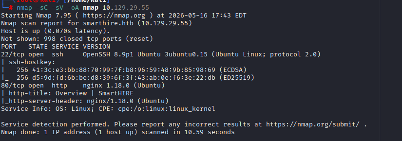

I can see there is a webpage, so I add the target IP and `smarthire.htb` to `/etc/hosts`.

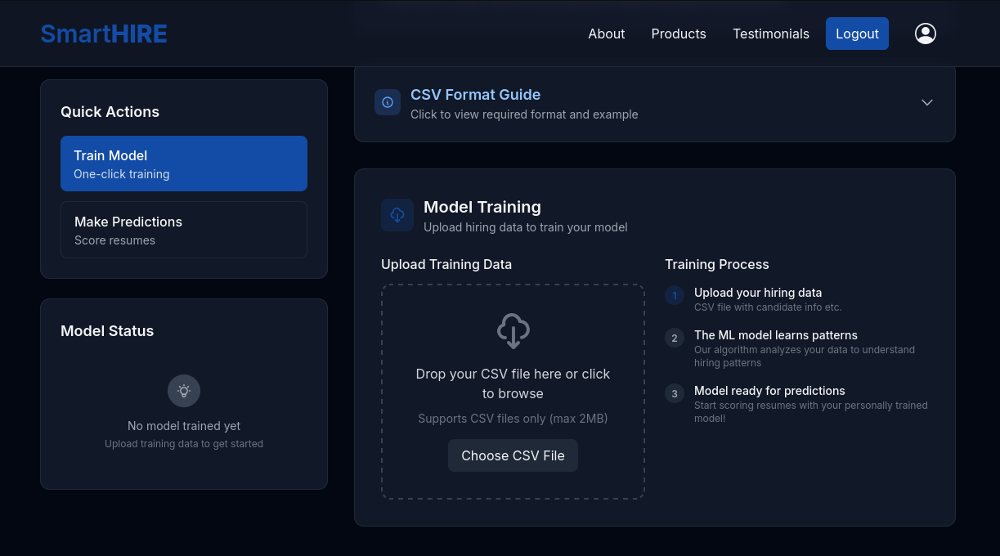

Going to the website revealed a login page which I set up an account on. We can see that this website is allowing CSV file uploads in order to train ML models. Let's do our due diligence and enumerate directories using gobuster.

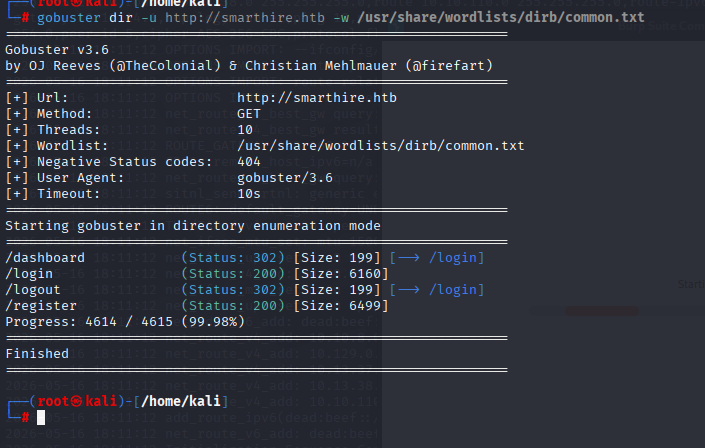

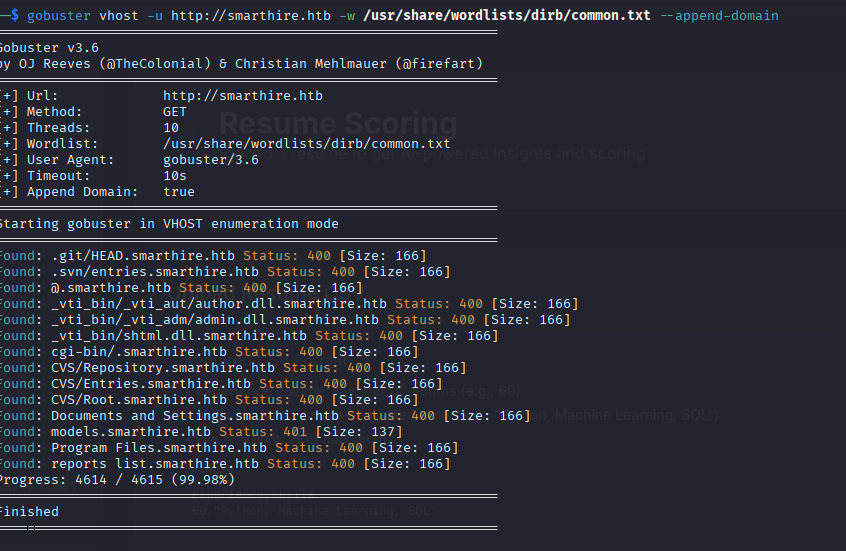

Regular dir mode didn't return much that I didn't already see, so I checked for Vhosts and found `models.smarthire.htb`. Let's add `models.smarthire.htb` to `/etc/hosts` and then navigate to it in browser.

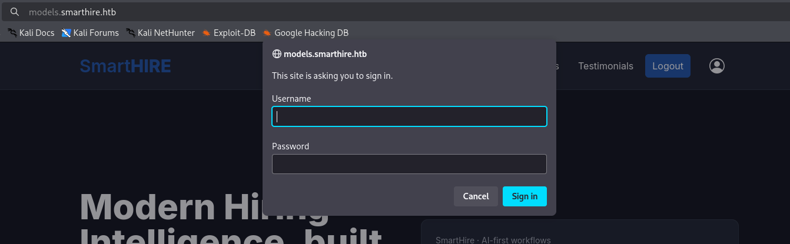

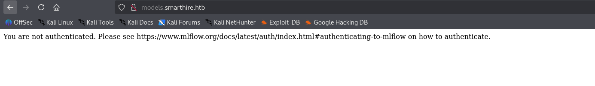

Canceling the sign-in process reveals version information about what service they are using to train and deploy models. Let's see if there are any default credentials for MLflow.

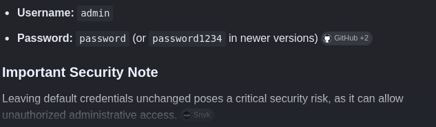

A simple Google search reveals the default credentials.

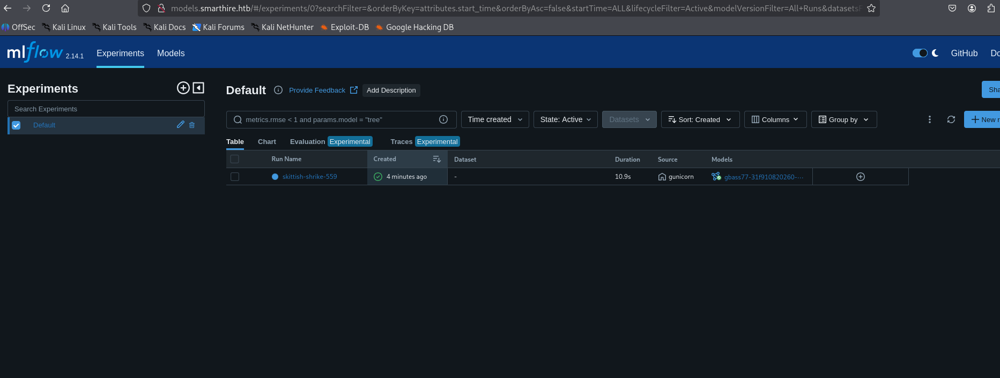

---

## Attack

Thankfully the default credentials actually work, and we can view our model that we had previously trained. We can also see this is **MLflow 2.14.1**, which has a known [CVE-2024-37054](https://www.cve.org/CVERecord?id=CVE-2024-37054).

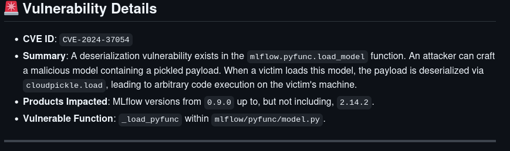

We can upload a malicious model that depickles an included payload and run any command we want on the host machine. Let's try to get a reverse shell.

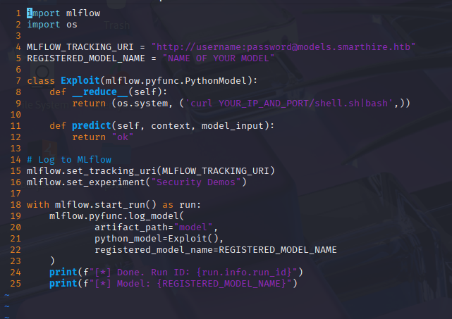

Numerous failed attempts at running the original POC led me to rewrite the script to simply download a file from my host machine and run it immediately.

**Contents of `shell.sh`:**

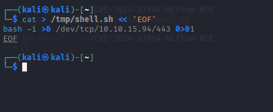

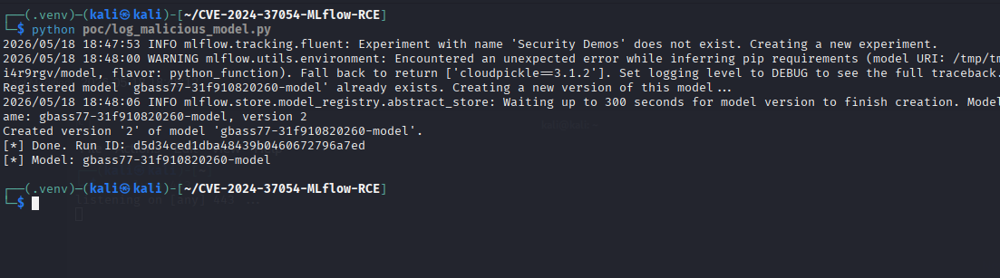

We run the POC and get an updated malicious model that can be used to run our reverse shell.

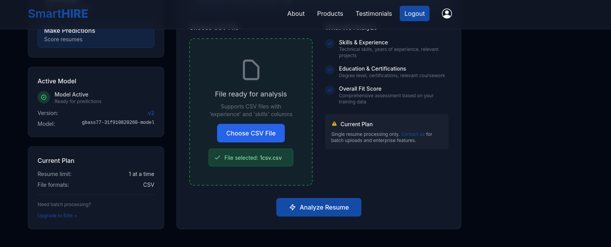

Return to the dashboard and upload an arbitrary CSV file, then click **Analyze Resume**. The contents of the CSV do not matter — calling the model will run the pickled payload regardless.

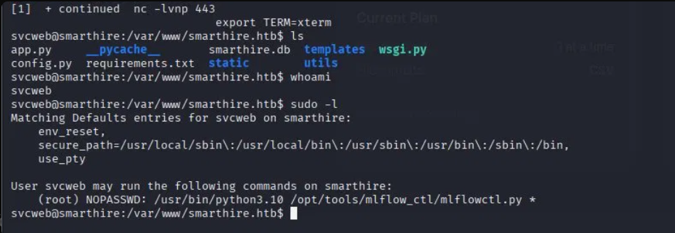

The reverse shell hits and we are in. Stabilize your shell and check `sudo -l`. This shows we can run arbitrary files as root with **no password** 😄. At this point you can run:

```bash
cat ~/user.txt
```

to get the user flag.

---

## Privilege Escalation

Curl LinPEAS from your attacking machine and run it. On this machine it reveals that `mlflowctl.py` uses `site.addsitedir`, which adds `.pth` files. Create a `.pth` file in `dev` that imports a malicious module to get the root flag.

```bash
echo "import os; os.system('cat /root/root.txt > /tmp/flag.txt')" > /opt/tools/mlflow_ctl/plugins/dev/exploit.pth
```

Then trigger it:

```bash
sudo /usr/bin/python3.10 /opt/tools/mlflow_ctl/mlflowctl.py status
cat /tmp/flag.txt
```

By this point you should have the root flag 🎉

---

## Final Thoughts

Getting user was the most time-consuming part of this box. It was not necessarily difficult — it relies on a publicly available CVE with a POC — however getting all dependencies in order so the script could actually run was a bit of a pain. Once you have user and can run LinPEAS, getting root is trivial.
